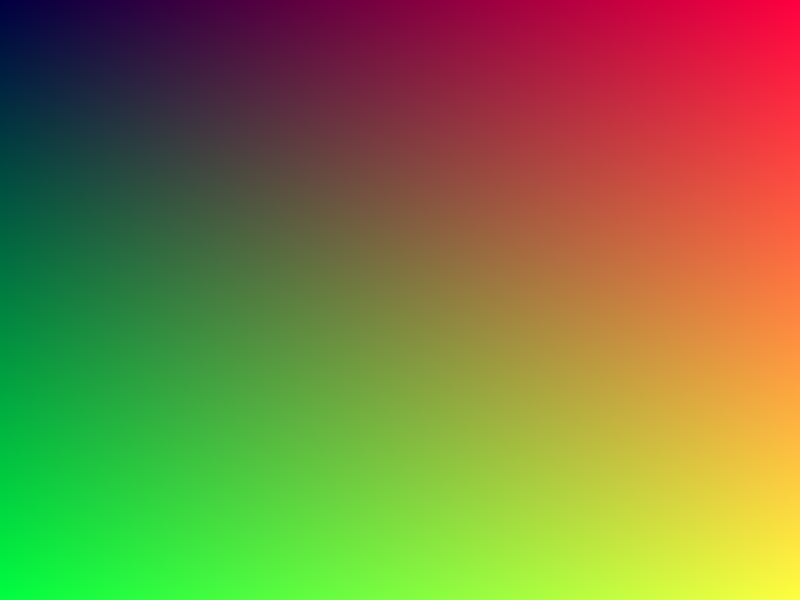

# Step 02 — Framebuffer & image output

> Part of the **GamePBR** devlog. Language: Odin · Target: CPU renderer → WebGPU.

**Status:** done — `make run` writes `gradient.ppm` + `gradient.png` and opens the window.
**Goal:** A pixel buffer you can clear and plot into, plus the ability to save it to disk — PPM (hand-rolled) then PNG.

## What & why
The framebuffer already existed from step 00 (`Color`, `Framebuffer`, `clear`, `set`). What this step adds is **getting a frame out to a file**, and that's more useful than it sounds:

- **Headless output.** Later steps can render a frame and dump it without opening a window — perfect for automated checks and for the result images in these posts.
- **Ground truth.** A saved image is a stable artifact to diff against when a change shouldn't alter output.
- **It decouples "render" from "display."** The renderer fills a buffer; whether that buffer goes to a window or a file is somebody else's problem.

## Theory
**PPM (P6) — the whole format on a postcard.** A binary PPM is just:

```
P6\n
<width> <height>\n
255\n
<raw RGB bytes, 3 per pixel, row by row, top-left first>
```

That's it. No compression, no color profiles, no chunks. `P6` is the binary magic (its ASCII cousin `P3` writes the numbers as text and is ~3× larger). `255` is the max channel value. After the header it's just width×height×3 bytes. Writing it by hand once demystifies what "an image file" even is.

**PNG — what you actually keep.** PNG is compressed (DEFLATE) and carries alpha, so it's the format for real output and for embedding in docs. It's far too involved to hand-roll here (zlib streams, filtering, CRC-checked chunks), so we use a library — and that choice ran into a real linking snag, below.

**Pixel layout & origin.** Our `Color` is four packed bytes `{r, g, b, a}`, and the framebuffer is row-major with pixel (0,0) at the **top-left** — the same origin PPM, PNG (stb), and raylib all use. Because the layout matches, PNG export needs no per-pixel copy: `raw_data(fb.pixels)` *is* the RGBA buffer, and the row **stride** is just `width * 4` bytes.

## Implementation
The framebuffer types now live in their own package, and disk I/O + color
conversion sit together in `utils`:

```
src/fb/      package fb     Color, Framebuffer + ops (create/destroy/clear/set)
src/utils/   package utils  image.odin (write_ppm, write_png) + color.odin (to_vec3/to_color)
src/         package main   main.odin, display seam, raylib backend
```

- **`src/utils/image.odin`** — `write_ppm` (pure Odin) and `write_png` (raylib's
  exporter) in one file. It imports `../fb` for the `Framebuffer` type.
- Import paths are relative to each file's directory, so from `src/utils/` the
  sibling packages are `../fb` and `../math` (not `fb`/`math`).

The PPM writer, in full — note there's nothing to it:

```odin
write_ppm :: proc(f: ^fb.Framebuffer, path: string) -> bool {
	header := fmt.tprintf("P6
%d %d
255
", f.width, f.height)
	buf := make([]u8, len(header) + f.width * f.height * 3)
	defer delete(buf)
	copy(buf[:], header)
	o := len(header)
	for p in f.pixels {
		buf[o+0] = p.r; buf[o+1] = p.g; buf[o+2] = p.b
		o += 3
	}
	return os.write_entire_file(path, buf) == nil
}
```

PNG hands raylib an `Image` view over our existing pixels (no copy) and lets it
write based on the `.png` extension:

```odin
img := rl.Image{
	data = raw_data(f.pixels), width = i32(f.width), height = i32(f.height),
	mipmaps = 1, format = .UNCOMPRESSED_R8G8B8A8,
}
return rl.ExportImage(img, cpath)
```

`main` renders one gradient with `fb.set` and dumps both files via
`utils.write_ppm` / `utils.write_png` *before* creating the window, so output
doesn't depend on the display at all.

## Results
```
$ make run
wrote gradient.ppm
wrote gradient.png
```

`gradient.ppm` is 1,440,015 bytes — exactly the 15-byte header plus 800×600×3 raw RGB. `gradient.png` is a ~20 KB compressed 800×600 RGBA image (same gradient, ~70× smaller — that's DEFLATE doing its job):



## Gotchas
- **`os.write_entire_file` returns an `Error`, not a `bool`** in current Odin — check `== nil`, don't assign it straight to a `bool`.
- **Duplicate-symbol link error with stb.** raylib statically bundles `stb_image_write`; also linking Odin's `vendor:stb/image` defines the same C symbols twice (`duplicate symbol '_stbi_write_png' …`). Fix: pick one. Since raylib is already linked, use `rl.ExportImage` and don't import `vendor:stb/image`.
- **PPM drops alpha.** P6 is RGB only. Fine for opaque frames; use PNG when alpha matters.
- **Origin matters.** Everything here assumes top-left origin; if an image ever comes out vertically flipped, that's the first thing to check (stb even has a `flip_vertically_on_write` toggle for the OpenGL bottom-left convention).
- **Relative import paths.** Odin resolves `import "fb"` relative to the *current file's* directory. From `src/utils/` that's `../fb` and `../math`, not `fb`/`math` — otherwise you get "Path does not exist: fb".
- **Outputs are gitignored.** `/gradient.ppm` and `/gradient.png` at the repo root are ignored; committed result images live under `docs/img/`.

## References
- Netpbm / PPM format: https://netpbm.sourceforge.net/doc/ppm.html
- raylib `ExportImage`: https://www.raylib.com/cheatsheet/cheatsheet.html

## Next
→ **Step 03 — Triangle rasterization**
