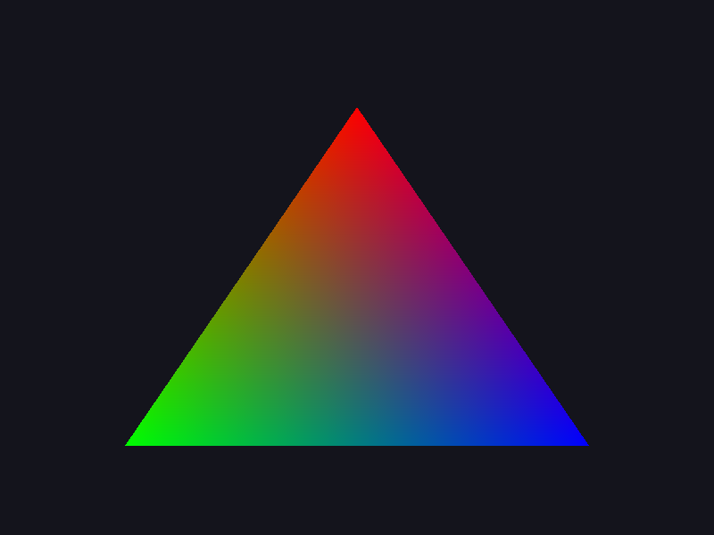

# Step 03 — Triangle rasterization

> Part of the **GamePBR** devlog. Language: Odin · Target: CPU renderer → WebGPU.

**Status:** done — `make run` fills a color-interpolated triangle; `make test` green (10/10).
**Goal:** Fill a triangle on the framebuffer using edge functions and barycentric coordinates, interpolating per-vertex colors across it.

## What & why
This is the first *actual rendering*. Everything so far was plumbing; now we turn three points into filled pixels. The triangle is the atom of real-time graphics — every mesh is a bag of them — so getting a correct, color-interpolating triangle fill is the foundation the rest of the renderer (textures, lighting, PBR) is built on. And the same barycentric weights that blend the corner colors here will later blend UVs, normals, and world positions.

## Theory
**The edge function.** For a directed line from `a` to `b`, the edge function of a point `p`

```
edge(a, b, p) = (p.x − a.x)·(b.y − a.y) − (p.y − a.y)·(b.x − a.x)
```

is twice the signed area of triangle `(a, b, p)`. Its **sign** tells you which side of the line `a→b` the point is on. A point is inside a triangle exactly when it's on the same side of all three edges — i.e. the three edge functions all share one sign. That single test is the whole "is this pixel in the triangle?" question.

**Barycentric coordinates.** The three edge values, divided by the triangle's total (signed) area, *are* the barycentric weights:

```
area = edge(a, b, c)
l0 = edge(b, c, p) / area   // weight of vertex a
l1 = edge(c, a, p) / area   // weight of vertex b
l2 = edge(a, b, p) / area   // weight of vertex c
```

They sum to 1, they're each in [0,1] inside the triangle, and they hit 1 at their own vertex and 0 on the opposite edge. So they double as the "is p inside?" test (all ≥ 0, up to winding) *and* the interpolation weights: any per-vertex value blends as `v = l0·va + l1·vb + l2·vc`. Here we blend colors; later it's UVs and normals, unchanged.

**Why a bounding box.** Testing every pixel on screen against every triangle would be O(pixels × triangles). Instead we compute each triangle's bounding box and only test pixels inside it — the standard, cache-friendly rasterization loop.

**Sample at pixel centers.** We evaluate the edge functions at `(x + 0.5, y + 0.5)`, not the pixel's corner. Using the center gives a consistent, gap-free coverage rule (and is what the fill/top-left conventions build on later).

## Implementation
New package `render` (types live with the code that uses them):

- **`src/render/triangle.odin`** — `Vertex` (screen-space `pos` + linear `color`), `edge`, `barycentric`, and `triangle` (the fill).
- **`src/render/render_test.odin`** — barycentric at the centroid and at a vertex, plus the edge sign test.

`render` depends only on `fb` and `math` (no raylib), so its tests stay fast and the package stays lean. The fill loop, trimmed:

```odin
area := edge(a.pos, b.pos, c.pos)
if area == 0 { return }          // degenerate
inv_area := 1.0 / area
// ... bounding box clamped to the framebuffer ...
for y in miny ..= maxy {
	for x in minx ..= maxx {
		p := m.Vec2{f32(x) + 0.5, f32(y) + 0.5}
		w0 := edge(b.pos, c.pos, p)
		w1 := edge(c.pos, a.pos, p)
		w2 := edge(a.pos, b.pos, p)
		inside := (w0 >= 0 && w1 >= 0 && w2 >= 0) || (w0 <= 0 && w1 <= 0 && w2 <= 0)
		if !inside { continue }
		l0 := w0 * inv_area; l1 := w1 * inv_area; l2 := w2 * inv_area
		col := a.color*l0 + b.color*l1 + c.color*l2
		fb.set(f, x, y, /* pack col to Color */)
	}
}
```

`main` clears to a dark background and draws one triangle with red/green/blue corners.

## Results
```
$ make test
Finished 7 tests ...   (math)
Finished 3 tests ...   (render)
$ make run
wrote triangle.ppm
wrote triangle.png
```



Red apex, green and blue base corners, smoothly blended — with the desaturated near-neutral center where all three weights are roughly equal. That muddy middle is the visual signature of correct barycentric interpolation.

## Gotchas
- **Winding / sign.** Depending on vertex order (CW vs CCW) the area is positive or negative, so the inside test accepts "all ≥ 0 **or** all ≤ 0." Hard-coding one sign silently culls triangles wound the other way (this is exactly what back-face culling will later exploit on purpose).
- **Degenerate triangles.** Zero area ⇒ divide-by-zero in the weights. Bail out early when `area == 0`.
- **Bounding box must be clamped** to `[0, width-1] × [0, height-1]`, or off-screen vertices index outside the framebuffer.
- **Pixel centers, not corners.** Sampling at integer corners causes seams/double-coverage between adjacent triangles; `+0.5` fixes it.
- **Per-pixel `edge` calls are wasteful.** Fine for learning; the edge function is affine in `p`, so it can be computed incrementally (add a constant per step). That's an optimization for the performance pass (step 17), not now.

## References
- Scratchapixel — rasterization & the edge function: https://www.scratchapixel.com/lessons/3d-basic-rendering/rasterization-practical-implementation//rasterization-stage.html
- Barycentric coordinates: https://en.wikipedia.org/wiki/Barycentric_coordinate_system

## Next
→ **Step 04 — Depth buffer**
