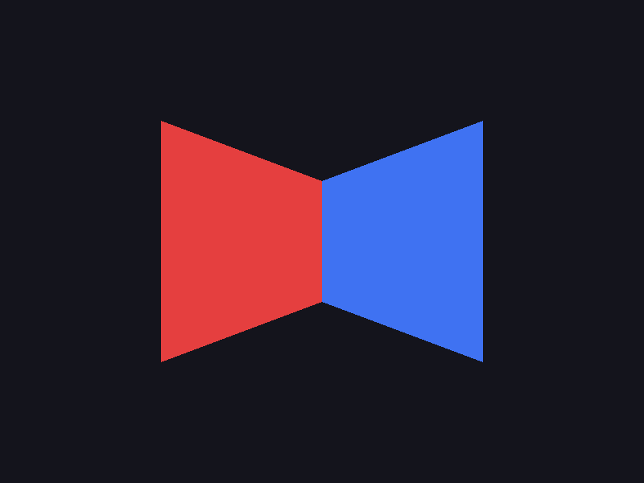

# Step 04 — Depth buffer

> Part of the **GamePBR** devlog. Language: Odin · Target: CPU renderer → WebGPU.

**Status:** done — two triangles interpenetrate correctly; `make test` green (11/11).
**Goal:** Add a z-buffer so overlapping triangles are resolved by distance, not by the order they're drawn.

## What & why
The step-03 rasterizer just writes whatever it draws last. With one triangle that's fine; with two that overlap, "last drawn wins" (painter's order) gives wrong results the moment shapes *interpenetrate* — no single ordering can be correct when triangle A is in front on one side and behind on the other. The fix every GPU uses is a **depth buffer**: alongside each pixel's color, store the depth of whatever currently occupies it, and only overwrite when a new fragment is nearer. It makes correctness independent of draw order, which is what lets a real scene throw triangles at the screen in any order.

## Theory
**One float per pixel.** The depth buffer is a `[]f32` the same size as the color buffer. Each frame it's cleared to the far value (here `1.0`), and as fragments are drawn:

```
z = interpolated depth at this pixel
if z < depth[pixel]:     # nearer than what's there?
    depth[pixel] = z     # remember the new nearest
    color[pixel] = ...   # and draw it
# else: discard — something nearer already owns this pixel
```

**Depth is just another interpolated attribute.** The barycentric weights from step 03 that blend color also blend depth: `z = l0·za + l1·zb + l2·zc`. So the vertex grows a third coordinate — `pos` goes from `Vec2` to `Vec3`, with `z` carrying depth — and the rasterizer interpolates it exactly like color.

**Convention: smaller = nearer.** We store depth so that a smaller value is closer to the camera, and clear to the far plane `1.0`. This matches the `[0,1]` clip-space depth that WebGPU/Metal use, so it'll line up when real projection arrives (step 05) and again at the GPU port. (OpenGL historically uses `[-1,1]`; we deliberately pick the newer convention.)

**Why it's draw-order independent.** Because each pixel keeps the nearest depth seen *so far*, a far triangle drawn after a near one is simply rejected. Draw the near one first or last — same result. That's the property painter's ordering can't give you, and the reason interpenetrating triangles resolve pixel-by-pixel.

## Implementation
- **`src/fb/framebuffer.odin`** — `Framebuffer` gains a `depth: []f32`; `create` allocates it, `destroy` frees it, and a new `clear_depth(f, value)` resets it to the far plane.
- **`src/render/triangle.odin`** — `Vertex.pos` is now `Vec3`; the fill interpolates `z` and does the z-test before writing. The 2D edge math uses `pos.xy`.

The heart of it, added to the per-pixel loop:

```odin
z := l0 * a.pos.z + l1 * b.pos.z + l2 * c.pos.z
idx := y * f.width + x
if z >= f.depth[idx] { continue }   // something nearer already here
f.depth[idx] = z
f.pixels[idx] = /* packed interpolated color */
```

A new test (`test_depth_occludes`) draws a **near** triangle first, then a **far** one over the same pixels, and asserts the near color survives — the draw-order-independence property in a single check.

## Results
```
$ make test
Finished 7 tests ...   (math)
Finished 4 tests ...   (render)
```

Two triangles tilted in depth so they interpenetrate — red near on its left edge and receding right, blue near on its right edge and receding left:



The clean vertical seam down the middle is the exact locus where the two triangles' interpolated depths are equal. Left of it red is nearer and wins every pixel; right of it blue wins. That crisp crossover — not a ragged overlap decided by draw order — is the depth buffer doing its job.

## Gotchas
- **Clear depth every frame**, not just color. Forgetting it leaves last frame's depths and randomly rejects new fragments.
- **Pick a depth direction and commit.** We use smaller = nearer, clear to `1.0`. If near/far ever look inverted (far things drawn on top), the comparison or clear value is backwards.
- **Depth interpolation isn't perspective-correct yet.** Right now `z` is linearly interpolated in screen space, which is fine because we hand-authored depths. Once a perspective projection is in (step 05), depth (and later UVs) must be interpolated in a perspective-correct way — that's a step-07 concern, flagged here.
- **Precision.** A real z-buffer spends most of its precision near the camera; with a perspective projection this becomes "z-fighting" on distant coplanar surfaces. Not visible yet with flat authored depths.

## References
- Depth buffering: https://en.wikipedia.org/wiki/Z-buffering
- LearnOpenGL — Depth testing: https://learnopengl.com/Advanced-OpenGL/Depth-testing

## Next
→ **Step 05 — Camera & MVP transforms**
