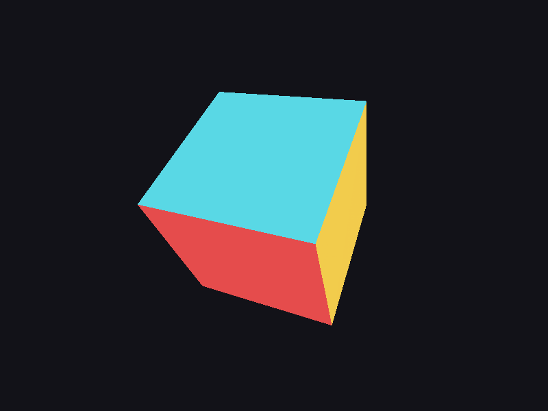

# Step 05 — Camera & MVP transforms

> Part of the **GamePBR** devlog. Language: Odin · Target: CPU renderer → WebGPU.

**Status:** done — a perspective cube renders and spins; `make test` green (14/14).
**Goal:** Turn 3D model-space geometry into screen pixels via the model→view→projection pipeline and the perspective divide.

## What & why
So far vertices were already in pixel coordinates — we placed a 2D triangle by hand. Real geometry lives in 3D and needs a camera. This step adds the chain every renderer runs: put an object in the world (**model**), look at it from somewhere (**view**), squash that view into a clip volume with perspective (**projection**), divide by w to get normalized coordinates, and map those to the screen. Once this works, we can draw *any* 3D mesh — which is exactly what step 06 does.

## Theory
**The MVP chain.** A model-space point becomes a clip-space point by three matrices, composed right-to-left (column-vector convention from step 01):

```
clip = Projection · View · Model · (x, y, z, 1)
```

- **Model** places/orients the object in the world (here: a spin about Y plus a fixed tilt).
- **View** is the camera's inverse transform — `mat4_look_at(eye, target, up)` builds the camera's right/up/-forward axes and moves the world so the eye sits at the origin looking down -z.
- **Projection** — `mat4_perspective(fov_y, aspect, near, far)` — applies foreshortening: it scales x/y by the focal length and, crucially, puts a useful value in **w**.

**The perspective divide.** Projection outputs *homogeneous* clip coordinates. Dividing xyz by w is what actually produces perspective — distant points have larger w, so dividing shrinks them. After the divide you're in **NDC** (normalized device coordinates): x,y in [-1,1], and (our convention) z in [0,1].

**Viewport map.** NDC → pixels: `x = (ndc.x·0.5 + 0.5)·width`, and `y = (1 − (ndc.y·0.5 + 0.5))·height` — the y flip because NDC is y-up but our framebuffer is y-down. The NDC z carries straight through as the depth value the z-buffer already knows how to test.

**Why z in [0,1] (again).** `mat4_perspective` maps the near plane to 0 and the far plane to 1, matching the depth buffer's clear value and WebGPU/Metal's clip space — so projected depth drops straight into step 04's z-test, and it'll port to the GPU with no remap.

## Implementation
Camera matrices landed in `gmath` (deferred from step 01):

- **`src/math/mat.odin`** — `mat4_perspective` (RH, z in [0,1]) and `mat4_look_at` (RH view).
- Tests: `look_at` maps the eye to the origin and the target 5 units down -z; `perspective` maps near→0 and far→1 in depth.

The pipeline lives in `render`:

- **`src/render/camera.odin`** — `Camera` struct + `camera_view_proj` (= projection · view).
- **`src/render/pipeline.odin`** — `Vertex3` (model-space), `project` (MVP → divide → viewport), and `triangle3` (project three vertices, then hand them to the step-03/04 rasterizer).

The core of `project`:

```odin
clip := mvp * m.Vec4{v.pos.x, v.pos.y, v.pos.z, 1}
if clip.w <= 0 { return {}, false }          // behind the camera
inv_w := 1.0 / clip.w
ndc := m.Vec3{clip.x*inv_w, clip.y*inv_w, clip.z*inv_w}
sx := (ndc.x*0.5 + 0.5) * f32(width)
sy := (1.0 - (ndc.y*0.5 + 0.5)) * f32(height) // y flip
return Vertex{pos = {sx, sy, ndc.z}, color = v.color}, true
```

`main` builds a cube (8 corners, 6 colored faces → 12 triangles), spins it, and draws it. The depth buffer from step 04 sorts the faces; no back-face culling yet, so every face is drawn and the z-test keeps the nearest.

## Results
```
$ make test
Finished 10 tests ...   (math)
Finished 4 tests ...   (render)
```

A perspective cube, three faces visible, correctly foreshortened and depth-sorted:



The parallel edges of the cube visibly converge — that's perspective. The back three faces are hidden not by draw order but by the z-buffer keeping the nearest fragment at every pixel. In the window it spins about Y.

## Gotchas
- **Compose in the right order.** `Projection · View · Model`, applied to a column vector. Get the order backwards and the object lands in the wrong space entirely.
- **Divide by w, always.** Skipping the perspective divide gives an orthographic (flat) look. It's the single line that makes 3D look 3D.
- **`w <= 0` means behind the camera.** Those points must be dropped or clipped; dividing by a non-positive w produces garbage that smears across the screen. We drop whole triangles for now — real near-plane clipping is a later refinement.
- **Flip y for the viewport.** NDC is y-up; the framebuffer is y-down. Forget the flip and the scene renders upside down.
- **Depth isn't perspective-correct-interpolated yet.** The z-test uses the projected NDC z per vertex, interpolated linearly in screen space — fine for flat-shaded faces, but color/UV interpolation will need the perspective-correct version in step 07.

## References
- LearnOpenGL — Coordinate systems (MVP): https://learnopengl.com/Getting-started/Coordinate-Systems

## Next
→ **Step 06 — Mesh loading (OBJ)**
