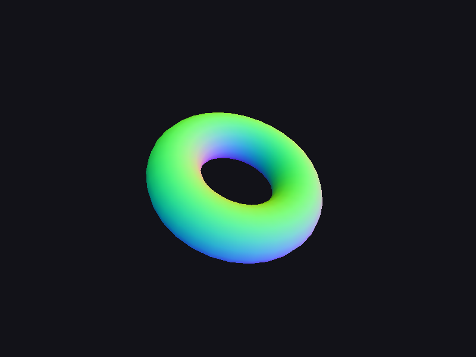
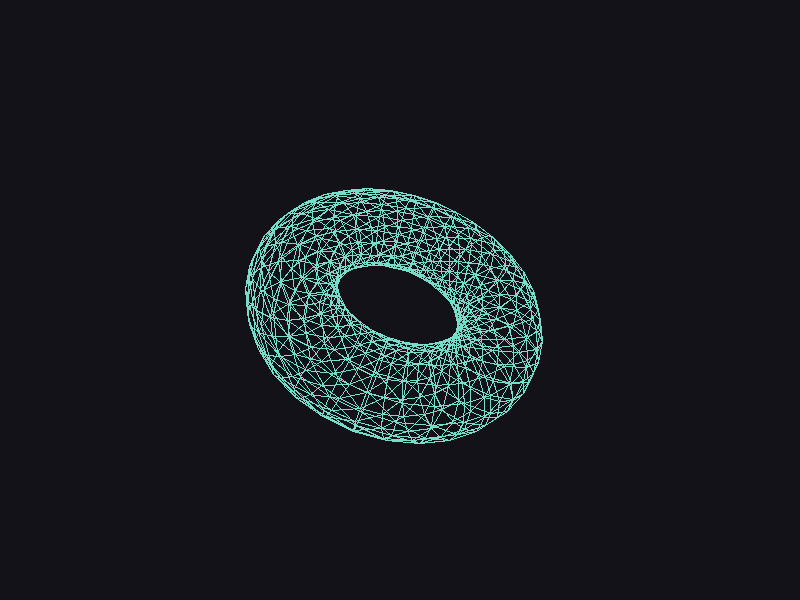

# Step 06 — Mesh loading (OBJ)

> Part of the **GamePBR** devlog. Language: Odin · Target: CPU renderer → WebGPU.

**Status:** done — loads an OBJ torus, draws it filled and wireframe; `make test` green (18/18).
**Goal:** Parse a Wavefront `.obj` into an indexed triangle mesh, then draw it — wireframe and filled.

## What & why
Up to now geometry was hand-typed (a cube's 8 corners). Real models come from files. This step adds a from-scratch **OBJ parser** producing a `Mesh`, so the renderer can draw arbitrary geometry. OBJ is the right first format: plain text, ~100 lines to parse, and test models are everywhere. (glTF comes later, when PBR materials arrive — it's the format built to carry metallic-roughness maps, which OBJ can't. See the note at the end.)

The key design choice: the loader produces a **loader-agnostic `Mesh`** (positions, normals, uvs, indices). OBJ is just one front-end; glTF will be another, both feeding the exact same type — so adding a format never touches the renderer.

## Theory
**OBJ in one paragraph.** A `.obj` is line-oriented text: `v x y z` (positions), `vt u v` (texture coords), `vn x y z` (normals), and `f ...` (faces). The catch is that a **face vertex is a *triple* of indices** — `f v/vt/vn v/vt/vn ...` — referencing the three streams *independently*, and the indices are **1-based** (with negative meaning end-relative). A corner might reuse position #4 but normal #10.

**Turning that into a GPU-style mesh.** GPUs want parallel attribute arrays plus one index list. So we **dedup**: each unique `(v, vt, vn)` triple becomes one output vertex, and a map from triple → output index lets shared corners collapse. Two triangles sharing an edge with identical triples share a vertex, not duplicate it.

**Triangulation.** OBJ faces can be polygons (quads, n-gons). We fan-triangulate: a face `(0,1,2,3,...)` becomes triangles `(0,1,2), (0,2,3), ...`. Fine for the convex faces these files contain.

**Normals, computed if missing.** Many OBJ files omit `vn`. When absent, we compute smooth vertex normals by summing each triangle's cross product into its three vertices, then normalizing. The un-normalized cross product's length is proportional to the triangle's area, so the sum is automatically **area-weighted** — bigger triangles pull harder, which is what you want.

## Implementation
New package `mesh` (loader-agnostic, depends only on `gmath`):

- **`src/mesh/mesh.odin`** — `Mesh` (positions/normals/uvs/indices), `destroy`, `bounds`, `compute_normals`.
- **`src/mesh/obj.odin`** — `parse_obj` (the dedup + triangulate + normal logic) and `load_obj` (reads the file, calls `parse_obj`). Splitting parse from I/O means the parser is unit-testable on strings.
- **`src/mesh/obj_test.odin`** — quad → 4 verts / 2 tris with a computed +z normal; shared-edge dedup → 4 verts not 6; file normals kept.

Rendering the mesh (in `render`):

- **`src/render/mesh_draw.odin`** — `draw_mesh` (filled, colored by normal — a debug view, real shading is step 09+) and `draw_wire`.
- **`src/render/line.odin`** — a Bresenham line for the wireframe edges.

`main` loads `assets/torus.obj`, centers/scales it to view (`fit_transform` from the mesh bounds), and spins it. Press **W** in the window to toggle wireframe.

## Results
```
$ make test
Finished 11 tests ...  (math)
Finished 4 tests ...   (render)
Finished 3 tests ...   (mesh)
$ ./gamepbr
loaded torus: 561 vertices, 1024 triangles
```

Filled (surface colored by normal, depth-sorted) and wireframe (the quad grid, each quad fan-split into two triangles — hence the diagonals):




The smooth color gradient confirms per-vertex normals interpolate correctly; the visible hole and clean silhouette confirm the z-buffer is sorting the surface. (The wireframe draws every edge — it ignores depth, so you see through to the back, which is normal for a plain wireframe.)

## Gotchas
- **1-based indices.** OBJ counts from 1, not 0. Off-by-one here mangles the whole mesh. Negative indices are end-relative.
- **Independent index streams.** `f` references `v`, `vt`, `vn` separately. You can't assume "vertex N" has "normal N" — dedup on the whole triple.
- **`os.read_entire_file` returns an `Error` + needs an allocator** in current Odin; `atof`/`atoi` are deprecated (use `strconv.parse_f64` / `parse_int`).
- **Fan triangulation assumes convex faces.** True for these files; concave n-gons would need real triangulation.
- **Wireframe ignores depth.** Intentional here; hidden-line removal is extra work not worth it at this stage.

## Why OBJ now, glTF later
OBJ gets geometry on screen cheaply and teaches indexed meshes. But it has **no standard PBR material** — its MTL companion is old Phong. **glTF 2.0** is built around the metallic-roughness workflow (base color, metallic, roughness, normal, emissive, tangents) — exactly this renderer's inputs — so it becomes worth adopting around the material steps (11–12). When it does, use Odin's `vendor:cgltf` binding rather than hand-rolling the JSON/buffer plumbing, and have it produce the **same `Mesh`** this step defined.

## References
- Wavefront OBJ format: https://en.wikipedia.org/wiki/Wavefront_.obj_file
- glTF 2.0 (for later): https://www.khronos.org/gltf/

## Next
→ **Step 07 — Texture mapping**
