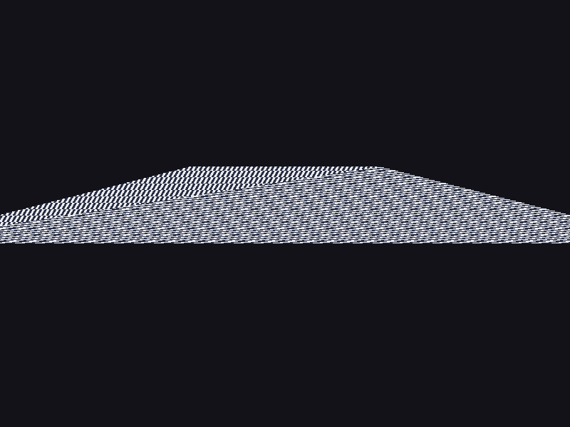
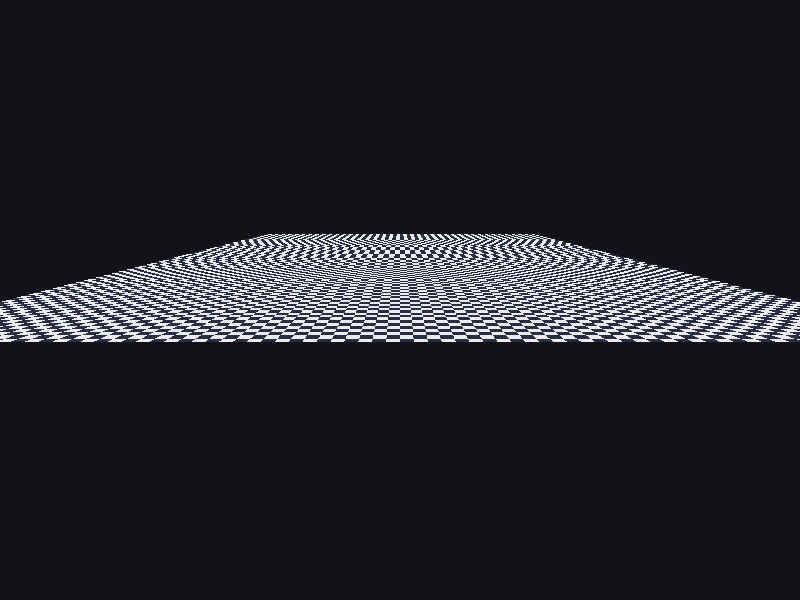
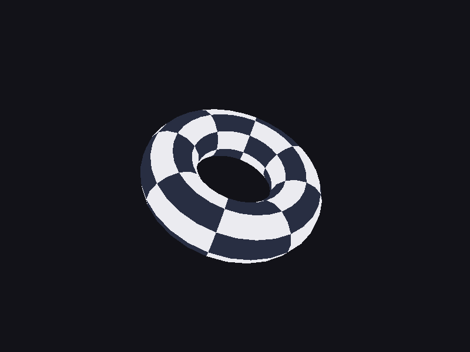

# Step 07 — Texture mapping

> Part of the **GamePBR** devlog. Language: Odin · Target: CPU renderer → WebGPU.

**Status:** done — textured meshes + perspective-correct interpolation; `make test` green (19/19).
**Goal:** Sample a texture with the mesh's UVs, and interpolate attributes **perspective-correctly** so textures don't warp under perspective.

## What & why
The mesh loader has been parsing `vt` (UV) coordinates since step 06; now we use them. Two pieces: **sampling** a texture at a UV, and — the real lesson — **perspective-correct interpolation**. Every attribute interpolated across a triangle (UVs, colors, and later world position and normals for lighting) has to be corrected for perspective, or it warps. This is the fix flagged all the way back in step 04, and it's foundational: PBR shading interpolates several attributes per pixel, and all of them need this.

## Theory
**Why linear interpolation is wrong under perspective.** Barycentric weights are computed in *screen* space, but the attributes we want to blend live in *3D* space, and perspective is a non-linear (projective) map between them. Equal steps across a triangle on screen are *not* equal steps across the surface in 3D — nearer parts cover more pixels than far parts. So interpolating a UV linearly in screen space slides the texture at the wrong rate and it visibly warps, worst of all across the diagonal seam where two triangles meet.

**The fix: interpolate `attribute/w`, and `1/w`, then divide.** The one quantity that *does* vary linearly in screen space is `1/w` (where `w` = clip-space w = `−z` in view space). So the trick is:

```
per vertex: keep inv_w = 1/w, and the attribute
per pixel:
  iw   = l0·(1/w0) + l1·(1/w1) + l2·(1/w2)      // interpolate 1/w  (linear, OK)
  attr = ( l0·A0/w0 + l1·A1/w1 + l2·A2/w2 ) / iw   // interpolate A/w, then divide
```

Dividing the perspective-weighted sum by the interpolated `1/w` undoes the projection and recovers the true surface-space attribute. That's the whole method.

**Depth is the exception.** Window depth (`ndc.z`) *does* interpolate linearly in screen space — that's a special property of the projection — so the z-buffer keeps using plain linear interpolation. Everything else (UV, color, normals) needs the `1/w` correction.

## Implementation
- **`src/render/texture.odin`** — `Texture` (`fb.Color` pixels), `sample` (nearest, UV-wrap, v-flipped for the OBJ convention), `make_checker`.
- **`src/render/triangle.odin`** — `Vertex` gains `uv` and `inv_w`.
- **`src/render/pipeline.odin`** — `project` now keeps `inv_w = 1/clip.w`; the fill (`fill`) does the perspective-correct interpolation above. A `correct` flag switches to plain affine interpolation — kept only to *show* the difference.
- **`src/render/mesh_draw.odin`** — `draw_mesh_textured`.

The heart of the fill:

```odin
z := l0*a.pos.z + l1*b.pos.z + l2*c.pos.z          // depth: linear (correct)
if z >= f.depth[idx] { continue }
iw := l0*a.inv_w + l1*b.inv_w + l2*c.inv_w          // interpolate 1/w
cw := 1.0 / iw
u  := (l0*a.uv.x*a.inv_w + l1*b.uv.x*b.inv_w + l2*c.uv.x*c.inv_w) * cw
v  := (l0*a.uv.y*a.inv_w + l1*b.uv.y*b.inv_w + l2*c.uv.y*c.inv_w) * cw
col := sample(tex, u, v)
```

## Results
```
$ make test
Finished 11 tests (math), 5 (render), 3 (mesh)
```

A checker floor receding to the horizon, drawn the wrong way and the right way:

**Affine (linear in screen space — wrong):** the pattern warps and bends, and there's a visible crease along the diagonal where the two triangles meet — the two halves disagree about where the texture is.



**Perspective-correct:** the checker recedes uniformly, lines stay straight, and the diagonal seam vanishes.



And the loaded torus, textured through its own UVs (depth-sorted, perspective-correct):



The crease in the affine floor is the giveaway — a single flat surface should never show a seam. That it disappears with the `1/w` correction is the proof the math is right.

## Gotchas
- **Only depth interpolates linearly.** UVs, colors, normals, world position — all need the `1/w` correction. Depth is the one exception; treating it like the others (or vice-versa) is a classic bug.
- **`w = −z`, and it must be positive.** We already drop triangles with any vertex behind the camera (`w <= 0`); dividing by a bad `w` here would smear the texture.
- **Nearest sampling aliases in the distance.** The far checker shimmers (moiré) — expected with point sampling and no mipmaps. Bilinear filtering and mipmaps are quality improvements for later.
- **UV origin.** OBJ uses bottom-left origin (v up); images are top-down. `sample` flips v so real textures aren't upside down.
- **`inv_w = 1` for pure 2D.** The affine `triangle` (2D screen-space) doesn't need any of this; only projected 3D geometry does.

## References
- Perspective-correct interpolation: https://en.wikipedia.org/wiki/Texture_mapping#Perspective_correctness
- Scratchapixel — perspective-correct interpolation: https://www.scratchapixel.com/lessons/3d-basic-rendering/rasterization-practical-implementation/perspective-correct-interpolation-vertex-attributes.html

## Next
→ **Step 08 — Normals & tangent space**
