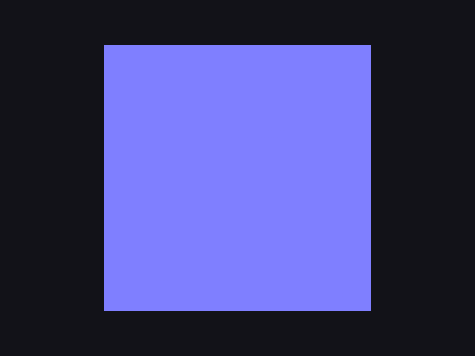
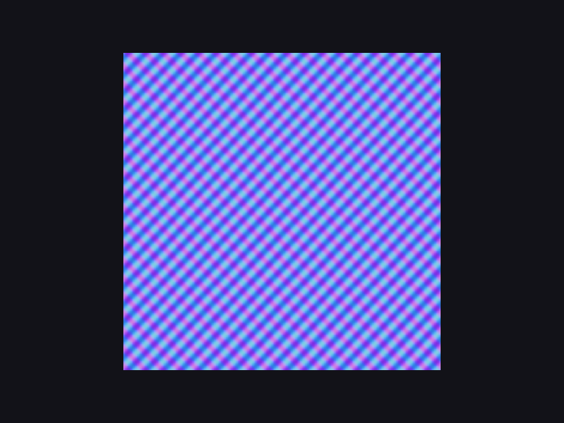
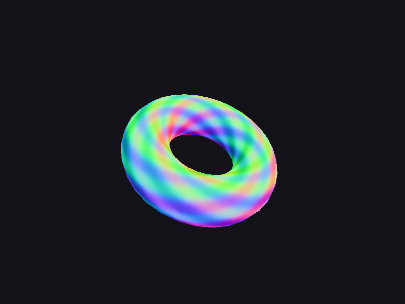

# Step 08 — Normals & tangent space

> Part of the **GamePBR** devlog. Language: Odin · Target: CPU renderer → WebGPU.

**Status:** done — world-space normals, TBN, and normal mapping; `make test` green (22/22).
**Goal:** Get normals into world space correctly (the normal matrix), build the TBN basis from per-vertex tangents, and perturb normals with a tangent-space normal map.

## What & why
Lighting (next step) is all dot products with the surface **normal**, in **world space**. So two things have to be right first. (1) Normals must be transformed to world space *correctly* — not with the plain model matrix, which skews them under non-uniform scale. (2) To add surface detail without more triangles, normal mapping stores per-texel normals in a texture; using them means building a per-pixel frame (the **TBN** basis) to bring a tangent-space normal into world space. Both are prerequisites for PBR — this is the last geometry piece before light.

## Theory
**The normal matrix.** A normal is perpendicular to the surface, and perpendicularity is *not* preserved by an arbitrary linear transform. Transform a surface by a non-uniform scale and a normal transformed the same way stops being perpendicular. The fix: transform normals by the **inverse-transpose** of the model's upper-3×3. For a pure rotation (or uniform scale) the inverse-transpose equals the rotation itself, so it only matters under non-uniform scale — but it's cheap insurance and the correct thing. (Tangents, being *in* the surface, transform by the plain model matrix.)

**Tangent space.** A normal map stores normals relative to the surface: +Z points straight out, and X/Y lie in the surface aligned with the texture's U/V axes. To use one you need, at each point, a coordinate frame on the surface: **T** (tangent, +U direction), **B** (bitangent, +V direction), **N** (normal). We already have N; T is solved from how UVs change across a triangle relative to how positions change (invert the 2×2 of UV deltas against the edge vectors), then orthonormalized against N (Gram-Schmidt). B is just `cross(N, T)`.

**The TBN transform.** `[T B N]` as columns is the matrix that takes a tangent-space vector into world space. So normal mapping is: sample the map → decode to a tangent-space normal `(x,y,z)` → `world = x·T + y·B + z·N` → normalize. That's it. A flat surface with a bumpy normal map now reports per-pixel normals as if it were bumpy, and lighting (next step) will shade it accordingly.

**Interpolation.** N and T are interpolated across the triangle **perspective-correctly** (the step-07 `1/w` method), same as UVs — one more reason that fix was foundational.

## Implementation
- **`src/math/mat.odin`** — `Mat3`, `mat3_from_mat4`, `mat3_inverse` (closed-form), `mat3_transpose`, and `normal_matrix` (= inverse-transpose). Tests: inverse-transpose of a rotation is the rotation; under `scale(2,1,1)` a normal stays perpendicular to the scaled tangent.
- **`src/mesh/mesh.odin`** — `tangents` field + `compute_tangents` (solve from positions/UVs, orthonormalize), plus `make_plane`. Test: a plane's tangent points along +U and is perpendicular to the normal.
- **`src/render/texture.odin`** — `make_normal_map` (an egg-carton bump field) + `sample_normal` (decode `rgb*2−1`).
- **`src/render/pipeline.odin`** — `Vertex`/`Vertex3` carry world `normal` + `tangent`; the fill builds the TBN per pixel and outputs the perturbed world normal.
- **`src/render/mesh_draw.odin`** — `draw_mesh` now takes the model matrix (world-space normal visualization), plus `draw_mesh_normalmapped`.

The per-pixel heart:

```odin
N := normalize(interp(normal))
T := normalize(interp(tangent) - N*dot(N, interp(tangent)))  // re-orthonormalize
B := cross(N, T)
sn := sample_normal(nmap, u, v)             // tangent-space normal, [-1,1]
world_n := normalize(sn.x*T + sn.y*B + sn.z*N)
```

## Results
```
$ make test
Finished 13 tests (math), 5 (render), 4 (mesh)
```

A flat quad, geometric normal vs normal-mapped — the flat version is a single color (one constant normal), the normal-mapped version reports a different normal at every texel:




And on the torus, the smooth rainbow is the world-space normal sweeping through every direction, with the normal map's ripples perturbing it per pixel:



(Colors here are the normal itself, `n*0.5+0.5`, not lighting — that's step 09. This view is exactly how you debug normals: a flat surface should be one color, and a correct normal map adds fine variation without changing the overall shape's gradient.)

## Gotchas
- **Use the normal matrix for normals, the model matrix for tangents.** They transform differently. Using the model matrix for normals looks fine until something has non-uniform scale, then shading goes subtly wrong.
- **Re-orthonormalize T per pixel.** Interpolation drifts T off-perpendicular to N; Gram-Schmidt (`T − N·dot(N,T)`) fixes it before building B.
- **Normal maps are mostly blue.** `(0,0,1)` encodes to `(128,128,255)` — the familiar periwinkle. If a decoded normal map looks green/red dominant, the channel order or the `*2−1` decode is off.
- **Handedness / seams.** A consistent tangent sign matters; mirrored UVs can flip the bitangent. Not an issue for the generated map here, but real assets store a tangent `w` for handedness.
- **`transpose` isn't a builtin** in this Odin — hand-rolled `mat3_transpose`.

> Interactive companion: [concepts/tbn.html](../concepts/tbn.html) — orbit the TBN frame and watch `n_world = nx·T+ny·B+nz·N`, and drag UV vertices to see the tangent solve.

## Appendix — derivations & what's actually stored

### What a normal map stores: 3 numbers, not the TBN
A tangent-space normal map stores **only the tangent-space normal** `(nx, ny, nz)` per
texel — three channels (RGB), nothing more. The **TBN is not in the image**; it's
reconstructed at render time from the mesh: `N` and `T` are per-vertex attributes
(interpolated across the triangle) and `B = cross(N, T)`. Geometry + UVs make the frame;
the texture only says "relative to that frame, which way does this texel point?"

That's why the image is blue: it stores normals that are mostly `(0,0,1)` → `(0.5,0.5,1)`.

| what you store | looks like | to use | reusable? |
|---|---|---|---|
| tangent-space normal (3 ch) | blue | rebuild TBN from mesh, `nx·T+ny·B+nz·N` | yes — any mesh, tiles, deforms |
| object-space normal (3 ch) | rainbow | `normal_matrix · n` (no tangents) | no — welded to one mesh |
| the full TBN (9 floats) | — | — | pointless: 3× memory *and* not reusable |

Storing the frame in the texture would defeat the point — the frame is exactly the part
that's supposed to come from the geometry, so the same little blue image can work
everywhere.

### Deriving the tangent from UVs
The tangent is, by definition, the world-space direction you move when `u` increases:
`T = ∂P/∂u`, `B = ∂P/∂v`. Across a flat triangle `P` is affine in `(u,v)`, so these
gradients are constant and two edges pin them down. With edges and UV deltas from
vertex 0:

```
E1 = ΔU1·T + ΔV1·B
E2 = ΔU2·T + ΔV2·B
```

In matrix form the 2×2 of UV deltas maps (T,B) to (E1,E2); invert it
(`inv [[a,b],[c,d]] = (1/det)[[d,−b],[−c,a]]`, `det = ΔU1·ΔV2 − ΔU2·ΔV1`):

```
T = (1/det)·( ΔV2·E1 − ΔV1·E2 )     <- this is the code
B = (1/det)·( ΔU1·E2 − ΔU2·E1 )
```

Sum per-vertex over the adjacent triangles and normalize for a smooth field. Then
orthonormalize T against the (smooth) normal — Gram-Schmidt removes T's component along N:

```
T⊥ = T − (N·T)·N        (N·T = T's shadow on unit N; subtract it → T ⟂ N)
```

and take `B = cross(N, T)` (unit & perpendicular for free; cheaper than storing B). A
mirrored UV island flips the true bitangent, so production assets store a handedness sign
`w` and use `B = w·cross(N, T)`.

### Reconstructing the world normal
The decoded texel `(nx,ny,nz)` is a vector written **in the basis** `{T,B,N}`. By the
definition of coordinates-in-a-basis, the same vector in world space is just the linear
combination of the (world-space) basis vectors:

```
n_world = nx·T + ny·B + nz·N  =  [ T | B | N ] · (nx,ny,nz)ᵀ
```

`[T|B|N]` is the TBN matrix. Because the frame is orthonormal it's a rotation, so its
inverse is its transpose (`M⁻¹ = Mᵀ`) — that's the matrix you'd use to instead bring the
*light* into tangent space. Check: `(0,0,1)` → `n_world = N` (flat texel = geometric
normal); tilt toward +x → `n_world` tilts toward `T`.

## References
- Normal matrix (why inverse-transpose): https://www.scratchapixel.com/lessons/mathematics-physics-for-computer-graphics/geometry/transforming-normals.html
- LearnOpenGL — Normal Mapping: https://learnopengl.com/Advanced-Lighting/Normal-Mapping

## Next
→ **Step 09 — Baseline lighting**
