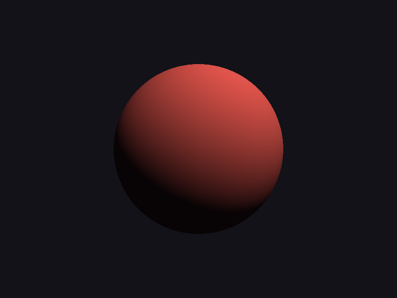
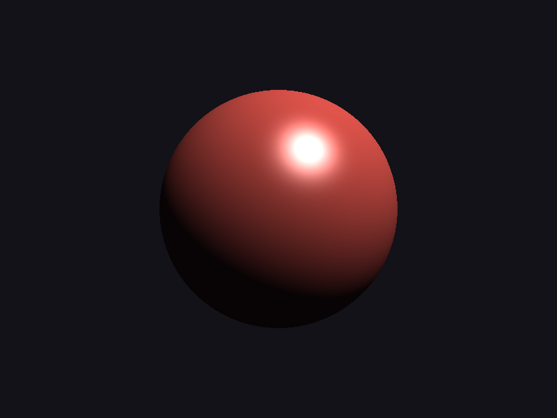
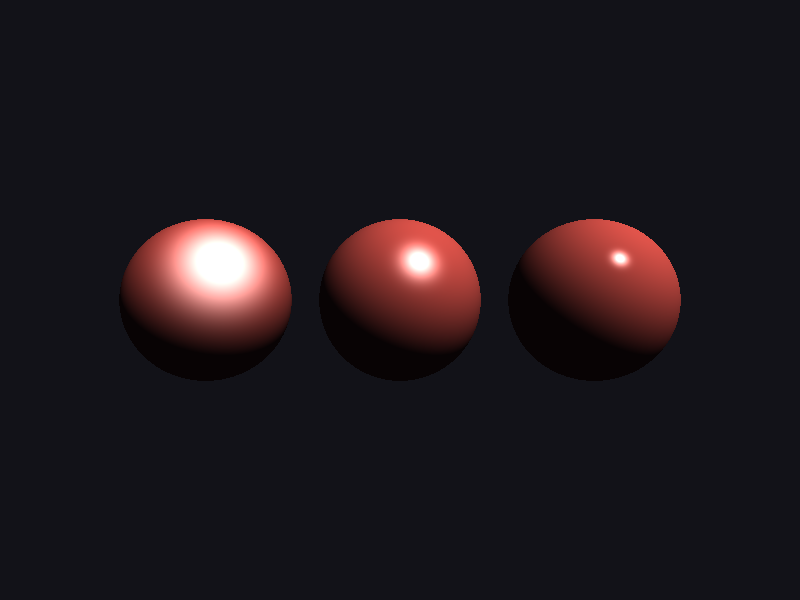

# Step 09 — Baseline lighting (Lambert + Blinn-Phong)

> Part of the **GamePBR** devlog. Language: Odin · Target: CPU renderer → WebGPU.

**Status:** done — directional light, Lambert diffuse + Blinn-Phong specular, per-pixel; `make test` green (28/28).
**Goal:** Shade a surface with actual light for the first time — a simple, classic, *non-physical* model — so the PBR steps that follow have a concrete "before" to improve on.

## What & why
Everything so far produced color from geometry: interpolated vertex colors, a texture sample, a normal visualized as RGB. None of it reacts to a light. This step adds the first real **shading model**: given a surface point, its normal, a light, and the viewer, compute how bright the surface looks.

The model here is the one every real-time renderer used before PBR: **Lambert** for the diffuse (matte) response and **Blinn-Phong** for the specular (shiny) highlight. It is deliberately the "before." It looks plausible, it is cheap, and it is *wrong* in specific ways — it isn't energy-conserving, its parameters (`shininess`, a specular tint) are artist knobs with no physical meaning, and it double-counts energy at grazing angles. Steps 10–11 replace the two lobes with the Cook-Torrance BRDF, which fixes exactly those faults. Doing the naive version first makes the physical version legible: you can see what each physically-based term is *for*.

## Theory

**The setup.** At a shaded point we have four unit vectors, all in world space: the surface normal **N**, the direction to the light **L**, the direction to the viewer **V**, and (Blinn-Phong's trick) the half-vector **H**. A directional light ("the sun") has parallel rays, so **L** is the same everywhere — if `dir` is the direction the light travels, then `L = −dir`. **V** depends on position: `V = normalize(eye − P)`, which is why the pipeline now carries the world-space position `P` to every pixel.

**Lambert diffuse.** A perfectly matte surface scatters incoming light equally in all directions, so its brightness doesn't depend on where you view it from — only on how much light lands on it. The irradiance on a surface patch scales with the cosine of the angle between the normal and the light (a beam hitting at a slant spreads over more area, so each point gets less). That cosine is just `N·L`:

```
diffuse = albedo · max(N·L, 0)
```

The `max(…, 0)` clamp is not a detail — it's the whole back-face story. When the light is behind the surface, `N·L` goes negative; without the clamp you'd get negative light (and, worse, a second lit band on the far side). Clamping to zero is what makes the terminator — the line where a sphere falls into shadow — land in the right place. `albedo` is the surface's diffuse color (its reflectance).

**Blinn-Phong specular.** Shiny surfaces reflect the light *toward a particular direction* — the mirror reflection of **L** about **N** — and fall off as your view strays from it. The original Phong model measured `V` against the reflected light vector `R`. Blinn's refinement is cheaper and better-behaved: instead of reflecting, form the **half-vector** `H = normalize(L + V)` — the direction exactly between the light and the eye — and measure how close the surface normal is to it:

```
H        = normalize(L + V)
specular = specularTint · max(N·H, 0)^shininess
```

Why it works: `N·H` is 1 exactly when the surface is tilted to mirror the light straight into your eye, and drops off to either side. Raising it to a power `shininess` controls how fast it drops — a low exponent gives a broad soft sheen, a high exponent a tiny sharp glint. That single exponent is the "roughness" knob of the pre-PBR era (and it's exactly what step 11's GGX distribution replaces with a physically-grounded one). The specular term is gated on `N·L > 0` so a highlight never appears on a face the light can't reach.

**Ambient.** Neither lobe accounts for light that bounced off *other* surfaces before arriving — in this model the shadowed side of a sphere would be pure black. The crude fix is a flat **ambient** term: a constant fill added everywhere, `ambient · albedo`. It is a stand-in for global illumination, and a bad one (it flattens form), but it keeps shadows from crushing to zero. Step 15's image-based lighting is what finally replaces it with something defensible.

**The whole model.**

```
out = ambient·albedo  +  (diffuse + specular) · (lightColor · intensity)
```

That's the function. Note what's *not* there: no `1/π` normalization on the diffuse, no Fresnel, no geometric shadowing, nothing tying the specular's brightness to the diffuse's. Those absences are the subject of step 10.

## Implementation
- **`src/render/lighting.odin`** — the new module. `DirLight` (direction, color, intensity), `Material` (albedo, specular tint, shininess), and `ShadeCtx` (light + material + eye + ambient + optional albedo texture). The core is one pure function, `shade_blinn_phong(mat, light, N, V, albedo, ambient)`, kept isolated so step 11 can swap it for Cook-Torrance without touching the rasterizer.
- **`src/render/pipeline.odin`** — `Vertex`/`Vertex3` gain a `world_pos`; `fill` gets a new top-priority branch: when a `ShadeCtx` is supplied it interpolates the world normal and world position perspective-correctly, forms `V` from the eye, and calls the shading function. The normal-map and texture paths are untouched.
- **`src/render/mesh_draw.odin`** — `draw_mesh_lit`: transforms normals by the normal matrix and positions by the model matrix into world space, then feeds the lit pipeline.
- **`src/mesh/sphere.odin`** — `make_sphere`: a UV sphere, the canonical surface for judging a shading model (every normal direction present, smoothly varying).

The per-pixel heart:

```odin
L := normalize(-light.dir)
ndl := saturate(dot(N, L))
diffuse := albedo * ndl
spec := Vec3{}
if ndl > 0 {
    H := normalize(L + V)
    spec = mat.specular * pow(saturate(dot(N, H)), mat.shininess)
}
return ambient*albedo + (diffuse + spec) * (light.color * light.intensity)
```

## Results

Lambert diffuse alone — matte, viewpoint-independent, with the terminator where `N·L` crosses zero:



Add the Blinn-Phong lobe and a hard white highlight appears where the half-vector lines up with the normal:



The same light and material at `shininess` 8 / 48 / 256 — the highlight tightens from a broad sheen to a pinpoint. This single knob is the pre-PBR stand-in for surface roughness:



## Tests
`make test` → 28 total (math 13, render 9, mesh 6). New this step:
- **Lighting** (`src/render/lighting_test.odin`): head-on diffuse returns albedo; a back-facing surface collapses to the ambient floor (the `N·L` clamp); ambient is an exact floor under the fully-unlit case; the specular lobe peaks at `N·H = 1` and decreases as the view tilts off the mirror direction.
- **Sphere** (`src/mesh/sphere_test.odin`): vertex/index counts, and every vertex lies on the sphere with its normal equal to the radial direction.

## What's wrong with this (on purpose)
Hold these up against the next steps. The diffuse has no `1/π` and the specular's brightness is an arbitrary tint, so total reflected light can exceed incident light — no energy conservation. `shininess` is a feel, not a measurement. There's no Fresnel, so edges don't brighten the way real surfaces do, and no geometric term, so grazing highlights blow out. Metals and dielectrics use the same math with hand-tuned constants. Step 10 names each of these faults in the language of radiometry; step 11 fixes them with Cook-Torrance.

## Next
→ **Step 10 — PBR theory:** radiometry (radiance, irradiance), the rendering equation, what a BRDF is, and the energy-conservation constraints this baseline violates — the vocabulary for everything that follows.
