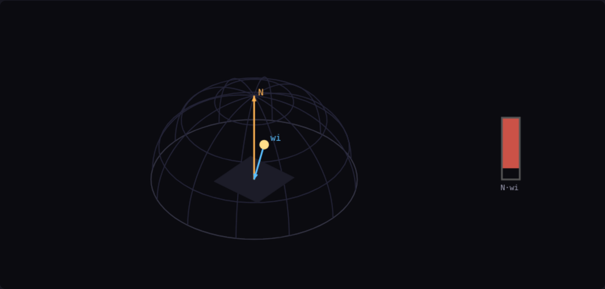
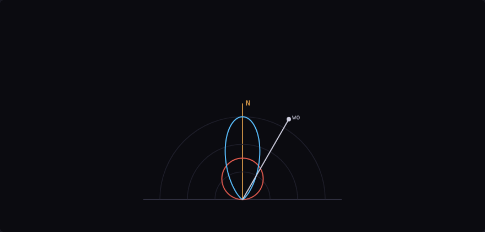

# Step 10 — PBR theory (radiometry, the rendering equation, BRDFs, energy)

> Part of the **GamePBR** devlog. Language: Odin · Target: CPU renderer → WebGPU.

**Status:** done — radiometry foundations + a measurable energy-conservation test harness; `make test` green (32/32).
**Goal:** Build the vocabulary and the *measuring stick* for everything that follows. No new pixels on screen — this step names what the step-09 baseline gets wrong, in the language step 11 will use to fix it.

## What & why
Step 09 shaded a surface with a formula that *looks* right. This step asks the harder question: is it *correct* — does it obey the physics of light transport? To answer that we need three ideas (radiometry, the rendering equation, the BRDF) and one hard constraint (energy conservation). Rather than take that constraint on faith, this step adds code that **measures** it: a numerical hemisphere integrator that computes how much light a surface actually reflects. Run it on normalized Lambert and you get the albedo back exactly; run it on the step-09 specular lobe and it reflects up to 2.6× the light that arrived. That measurement is the whole motivation for Cook-Torrance.

## Theory

**Radiometry — the quantities.** Light transport is bookkeeping of energy, and it pays to name the units precisely:
- **Radiant flux** (Φ, watts) — total power.
- **Irradiance** (E, W/m²) — flux arriving *per unit area*. This is where the cosine lives: a beam striking a surface at angle θ from the normal spreads its power over `1/cosθ` more area, so the irradiance each point receives scales with `cosθ = N·L`. That single fact is the entire physical content of Lambert's law.
- **Radiance** (L, W/m²/sr) — flux per unit area *per unit solid angle*: brightness along a single ray. Radiance is what a camera measures and what we ultimately write into a pixel. It is invariant along a ray in a vacuum, which is why it's the right currency for a renderer.

**The rendering equation.** Everything a renderer approximates is this one integral (Kajiya, 1986), here without the emissive term:

```
Lo(p, wo) = ∫_Ω  f(p, wo, wi) · Li(p, wi) · (N·wi)  dwi
```

In words: the radiance leaving point `p` toward the eye (`wo`) is the integral, over every incoming direction `wi` on the hemisphere Ω, of *(how the surface redirects light from wi to wo)* × *(incoming radiance)* × *(the cosine foreshortening)*. The interactive companion draws exactly this hemisphere — drag to orbit, and watch the `N·wi` term shrink to zero as the light sinks to the horizon.

**The BRDF.** The function `f(wo, wi)` — the **Bidirectional Reflectance Distribution Function** — is the surface's whole optical character: given light from `wi`, what fraction (per steradian) heads toward `wo`. A matte surface's BRDF is nearly flat (same in all directions); a mirror's is a spike. A *physical* BRDF obeys three rules:
1. **Non-negativity:** `f ≥ 0` — no surface removes light by reflecting it.
2. **Helmholtz reciprocity:** `f(wo, wi) = f(wi, wo)` — swapping eye and light changes nothing.
3. **Energy conservation:** it cannot reflect more than it receives. Formally, the **directional-hemispherical reflectance** must stay ≤ 1 for every `wo`:

```
R(wo) = ∫_Ω  f(wo, wi) · (N·wi)  dwi   ≤  1
```

**Lambert, done right.** A perfectly diffuse surface reflects the same radiance in all directions. For its reflectance to equal the albedo (and not exceed 1), the BRDF must be `f = albedo / π`. The `1/π` is not a fudge — it's what you get by demanding `R = albedo`:

```
R = ∫_Ω (albedo/π)(N·wi) dwi = (albedo/π) · ∫_Ω cosθ dwi = (albedo/π) · π = albedo
```

(The integral of `cosθ` over the hemisphere is exactly π.) **Step 09 omitted that `1/π`** — its diffuse was `albedo · cosθ`, which over-reflects by a factor of π. We hid it by also leaving physical light units off, so it "looked fine." It isn't.

## Implementation
This step is groundwork, so the code is a small, pure library plus the test harness that exercises it — no renderer changes.

- **`src/render/brdf.odin`**
  - `lambert_brdf(albedo) = albedo/π` — the diffuse BRDF, with the normalization step 09 lacked.
  - `hemisphere_dir(u1, u2)` — a uniform-solid-angle direction on the +Z hemisphere (pdf = 1/2π, cosθ = u1).
  - `lambert_reflectance(albedo, n_side)` — integrates `∫ f·cosθ dω` by deterministic stratified quadrature. Returns the directional-hemispherical reflectance.
  - `blinn_phong_reflectance(wo, shininess, n_side)` — the same integral applied to the *raw* step-09 specular lobe `(N·H)^shininess`, so its energy can be measured directly.

The integrator weights each sample by `1/pdf = 2π` and averages:

```odin
acc := Vec3{}
for i in 0..<n_side do for j in 0..<n_side {
    wi := hemisphere_dir((f32(i)+0.5)/f32(n_side), (f32(j)+0.5)/f32(n_side))
    acc += lambert_brdf(albedo) * wi.z        // f · cosθ
}
return acc * (2*π / f32(n_side*n_side))        // · (1/pdf), averaged
```

## Results
No render this step — the "result" is a measurement. From `make test` (the brdf tests print their integrals):

```
[brdf] Lambert reflectance = (0.6000, 0.3000, 0.9000), albedo = (0.60, 0.30, 0.90)
[brdf] Blinn-Phong reflectance: shininess 2 = 2.618 (>1 = energy gain), shininess 128 = 0.187
```

Normalized Lambert reflects its albedo to four decimals — energy-conserving by construction. The step-09 specular lobe, measured the same way, **reflects 2.6× the incident light** at a broad setting and loses 81% of it when tight: its brightness is untethered from the energy budget entirely.

The hemisphere of the rendering equation — surface patch, normal `N`, an incoming direction `wi`, and the `N·wi` foreshortening bar that collapses at grazing angles:



The two lobes and the reflectance readout (the diffuse cosine lobe in red, the specular petal in blue, tightening with the exponent):



> **Interactive companion:** [`concepts/pbr-theory.html`](../concepts/pbr-theory.html) — orbit the hemisphere, drag the light angle, sweep the shininess, and watch the live reflectance go red the moment the lobe breaks the energy bound.

## The faults, named
This is the checklist step 11 works down:
- **No `1/π` on the diffuse** — over-reflects by π (measured above as the reason the baseline needed no physical light units to look plausible).
- **Specular energy is unbounded** — `(N·H)^shininess` has no normalization; its reflectance can be >1 or ≪1 (measured: 2.618 and 0.187). GGX carries a normalization factor precisely to pin this at ≤ 1.
- **No Fresnel** — real surfaces reflect more at grazing angles; the baseline's reflectance is angle-independent. Fresnel-Schlick (F) adds it.
- **No geometric shadowing/masking** — microfacets occlude each other at grazing angles; without a G term, tight highlights blow out.
- **Diffuse and specular are unlinked** — energy that reflects specularly should not also reflect diffusely. The metallic-roughness workflow (step 12) ties them through F0 and metalness.

## Next
→ **Step 11 — Cook-Torrance direct lighting:** the microfacet specular BRDF `f = D·G·F / (4·(N·L)(N·V))`, with GGX (D), Smith (G), and Fresnel-Schlick (F) — each term fixing one fault named above, and the whole thing staying under the reflectance ceiling this step built the tooling to measure.
