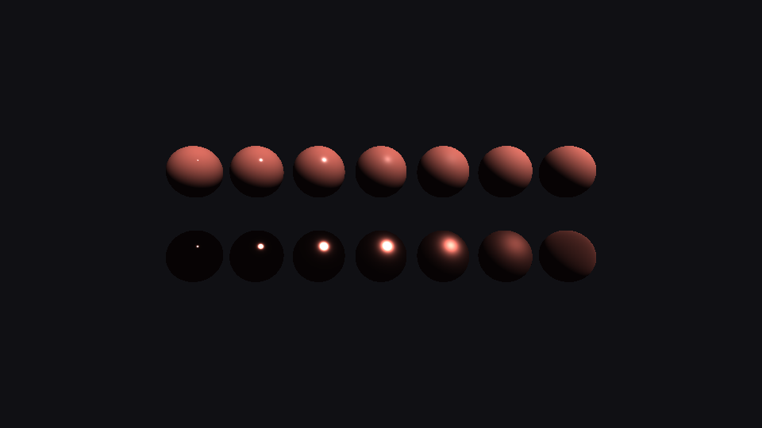
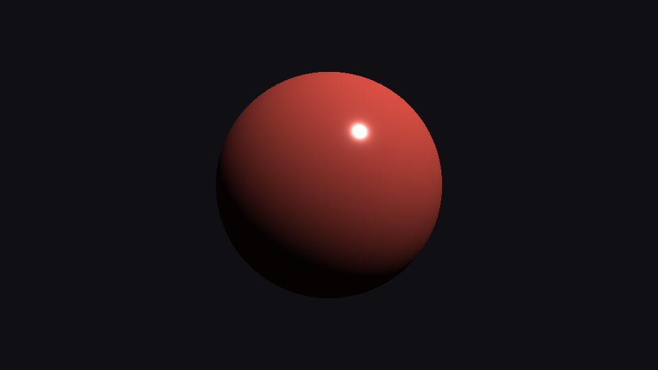

# Step 11 — Cook-Torrance direct lighting (GGX · Smith · Fresnel)

> Part of the **GamePBR** devlog. Language: Odin · Target: CPU renderer → WebGPU.

**Status:** done — microfacet specular BRDF with the metallic-roughness workflow, energy-conserving; `make test` green (37/37).
**Goal:** Replace step 09's two ad-hoc lobes with the Cook-Torrance microfacet BRDF — D, G, F — fixing every fault step 10 named, and verify numerically that it stays within the energy budget.

## What & why
Step 09 shaded with `albedo·cosθ + tint·(N·H)^shininess` — a formula tuned to *look* right. Step 10 measured how wrong it is: its specular lobe reflects up to 2.6× the incident light. This step swaps that lobe for the physically-based one used by every modern engine, parameterized the way artists actually author materials: **albedo, metallic, roughness**. The payoff is twofold — materials become *portable* (the same numbers look right under any lighting) and *correct* (the surface never reflects more than it receives).

## Theory

**Microfacets.** A rough surface is modeled as a sea of microscopic perfect mirrors (microfacets), each with its own normal. You can't see them individually, so shading becomes a statistical question: *of all the microfacets in this pixel, what fraction contribute a reflection toward the eye?* Three statistics answer it, and their product (over a geometric normalizer) is the specular BRDF:

```
f_spec(wo, wi) = D(h) · G(wo, wi) · F(wo, h)  /  (4 · (N·wo) · (N·wi))
```

where `h = normalize(wo + wi)` is the half-vector — the normal a microfacet would need to mirror `wi` into `wo`.

**D — normal distribution (GGX / Trowbridge-Reitz).** How many microfacets point along `h`. GGX won because of its long tails — real highlights have a hot core and a soft falloff, which a Gaussian misses:

```
D(h) = α² / ( π · ( (N·h)²(α² − 1) + 1 )² ),   α = roughness²
```

It is **normalized**: `∫ D(h)(N·h) dω = 1`. That normalization is the thing Blinn-Phong lacked — it's what keeps the lobe's total energy fixed as roughness changes, so a sharpening highlight gets *brighter*, not just *smaller*. Low roughness → a tall narrow spike; high roughness → a broad low dome. (Using `α = roughness²` makes the roughness slider feel perceptually linear.)

**G — geometry (Smith + Schlick-GGX).** At grazing angles microfacets block each other — some are shadowed from the light, some masked from the eye. `G ∈ (0,1]` is the surviving fraction. Smith splits it into two independent checks, one for the light path and one for the view path:

```
G1(x) = (N·x) / ( (N·x)(1 − k) + k ),   k = (roughness + 1)² / 8   (direct lighting)
G     = G1(wo) · G1(wi)
```

Without G, the `1/(4 N·V N·L)` denominator would blow the highlight up to infinity at the horizon; G is what tames grazing specular.

**F — Fresnel (Schlick).** Every surface becomes a mirror at a glancing enough angle (the shimmer on a road, a lake at sunset). F is the fraction reflected, rising from its head-on value `F0` to 1 at the grazing limit:

```
F(θ) = F0 + (1 − F0)(1 − cosθ)⁵,   cosθ = (wo·h)
```

**The metallic-roughness workflow.** `F0` is where metalness enters. **Dielectrics** (plastic, wood, skin) reflect about 4% of light head-on, uncolored, and have a diffuse lobe. **Metals** have *no* diffuse at all — their "color" is their specular `F0`. One `metallic` slider blends between the two:

```
F0 = lerp(vec3(0.04), albedo, metallic)
kd = (1 − F) · (1 − metallic)          // diffuse energy left after specular
color = ( kd · albedo/π  +  f_spec ) · radiance · (N·L)
```

The `kd` factor is the energy link step 10 flagged as missing: light that reflects specularly (F) is removed from the diffuse budget, and metals (`metallic = 1`) get no diffuse term whatsoever.

## Implementation
- **`src/render/cook_torrance.odin`** — `distribution_ggx` (D), `geometry_smith` / `geometry_schlick_ggx` (G), `fresnel_schlick` (F), `f0_from(albedo, metallic)`, and `shade_cook_torrance(...)` assembling them into outgoing radiance. Plus `cook_torrance_specular_reflectance(...)`, which runs the lobe through step 10's hemisphere integrator to measure its energy.
- **`src/render/lighting.odin`** — `Material` gains `metallic`/`roughness`; `ShadeCtx` gains a `model` (`Baseline` | `PBR`). The enum's zero value is `Baseline`, so every step-09 context is untouched.
- **`src/render/pipeline.odin`** — the lit branch now `switch`es on `shade.model`; the whole rasterizer, interpolation, and world-space setup are shared with the baseline path. No new draw proc — `draw_mesh_lit` just carries a PBR context.

The assembled specular term:

```odin
F0   := f0_from(albedo, mat.metallic)
D    := distribution_ggx(ndh, mat.roughness)
G    := geometry_smith(ndv, ndl, mat.roughness)
F    := fresnel_schlick(vdh, F0)
spec := (D * G) * F / (4 * ndv * ndl + 1e-4)
kd   := (Vec3{1,1,1} - F) * (1 - mat.metallic)
return ambient*albedo + (kd*albedo/π + spec) * radiance * ndl
```

## Results

The canonical PBR chart — one base color, **columns = roughness** (0.05 → 1.0, sharp to matte), **rows = metalness** (top dielectric, bottom metal):



Read it: the dielectric row keeps a diffuse body and a highlight that broadens with roughness. The metal row has almost no diffuse — just a specular highlight that spreads and dims as the surface roughens, going from a near-mirror glint to a soft sheen. That a smooth metal lit by a single light is *mostly black* is not a bug: a mirror with nothing to reflect shows nothing. Filling that black with a reflected environment is exactly what IBL (steps 15–16) does.

A glossy dielectric hero — diffuse body plus a tight, energy-correct Fresnel highlight:



The energy proof, from `make test` (compare the 2.618 of step 10's Blinn-Phong):

```
[ct] ∫D·cosθ dω (roughness 0.40) = 0.9881   (GGX is normalized)
[ct] CT specular reflectance (roughness 0.10, dielectric) = 0.006
[ct] CT specular reflectance (roughness 0.30, dielectric) = 0.039
[ct] CT specular reflectance (roughness 1.00, dielectric) = 0.012
```

The specular lobe never exceeds 1.0 — the whole point of the exercise.

## Tests
`make test` → 37 total (math 13, render 18, mesh 6). New (`src/render/cook_torrance_test.odin`): Fresnel endpoints (`F0` head-on, → 1 at grazing); `F0` metallic blend; GGX normalization (`∫D·cosθ dω ≈ 1` across roughness); Smith geometry bounded in (0, 1]; and the headline — Cook-Torrance specular reflectance stays < 1 at every roughness, where Blinn-Phong blew past 2.6.

## The step-10 faults, now fixed
- **Missing 1/π on diffuse** → diffuse is `albedo/π`.
- **Unbounded specular energy** → GGX is normalized and the reflectance is measured ≤ 1.
- **No Fresnel** → `fresnel_schlick`, with grazing brightening.
- **No geometric shadowing** → Smith `G` tames the `1/(4 N·V N·L)` denominator.
- **Diffuse & specular unlinked** → `kd = (1 − F)(1 − metallic)` ties them through the metallic-roughness workflow.

## Next
→ **Step 12 — Metallic-roughness workflow (textured):** drive albedo, metallic, and roughness from textures instead of constants, so a single mesh can carry spatially-varying materials — the authoring format these equations were built for.
