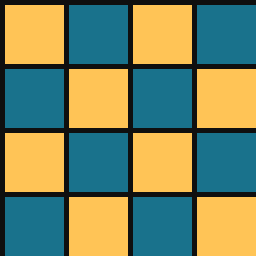
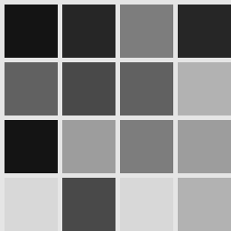
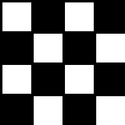
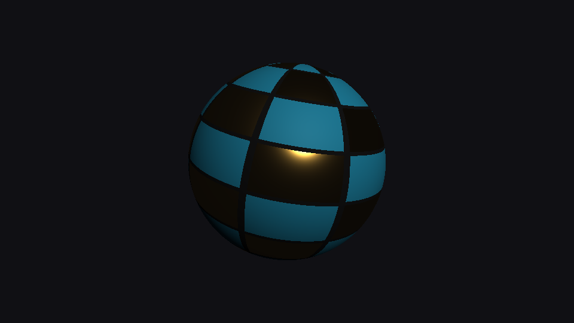
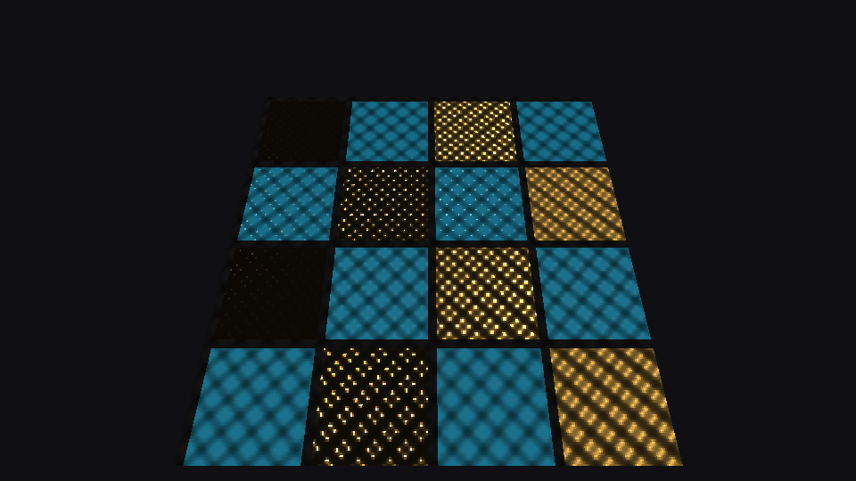

# Step 12 — Metallic-roughness workflow (textured)

> Part of the **GamePBR** devlog. Language: Odin · Target: CPU renderer → WebGPU.

**Status:** done — per-pixel albedo / metallic / roughness from textures (glTF conventions), normal maps feeding the PBR path; `make test` green (42/42).
**Goal:** Stop shading whole objects with one set of constants. Drive every material parameter from textures so a single mesh carries metal, paint and grout side by side — the format real assets ship in.

## What & why
Step 11 gave us the right BRDF, but every sphere in the grid was *one* material. Real surfaces aren't: a painted panel has bare metal where the paint chipped, smooth spots where it was polished, rough grout between tiles. The metallic-roughness workflow handles all of that with three textures, and the shading code barely changes — the BRDF already takes `albedo`, `metallic` and `roughness`; we just look them up per pixel instead of passing constants.

The important decision is *which conventions*. This step follows **glTF 2.0** exactly, so that when the renderer later loads real assets (or moves to WebGPU, where glTF is the lingua franca), the textures drop straight in.

## Theory

**The three maps.**
- **Albedo (base color)** — RGB. For dielectrics it's the diffuse color; for metals it's the *specular* color (it becomes F0). No lighting baked in: no shadows, no highlights — just reflectance.
- **Metallic** — a mask, ideally 0 or 1. Real materials are either conductors or insulators; intermediate values only make sense at transitions (anti-aliased edges, dust over metal).
- **Roughness** — 0 (mirror) to 1 (chalk). This is the per-pixel `α` input to GGX and Smith; it's where most of a material's character lives.

**glTF channel packing.** Metallic and roughness are scalars, so glTF packs them into one texture: **G = roughness, B = metallic** (R is left free — engines commonly put ambient occlusion there, the "ORM" texture). One fetch, two parameters.

**Factors × textures.** Every glTF map is multiplied by a constant factor on the material:

```
albedo    = albedoFactor    × albedoMap(uv).rgb
roughness = roughnessFactor × mrMap(uv).g
metallic  = metallicFactor  × mrMap(uv).b
```

A fully map-driven material uses factors of 1; a material with no maps is just its factors. One code path covers both, and step 11's constant materials keep working unchanged.

**Roughness floor.** As roughness → 0, GGX's D collapses toward a delta: the highlight shrinks to a sub-pixel point of enormous value that a rasterizer samples or misses — aliasing. Engines clamp to a small minimum; we use **0.04**.

**Normal maps in the lit path.** Step 08 decoded tangent-space normal maps but only *visualized* them. Now the perturbed normal feeds the BRDF: interpolate N and T, re-orthonormalize T against N, build B = N × T, and rotate the map's normal into world space. Same math, finally lit. Because the BRDF is evaluated with the perturbed N, the bumps change *both* diffuse shading and where specular glints land — which is why rough and smooth tiles look so different under the same bumps below.

**A note on color spaces (deferred to step 14).** Real albedo textures are stored **sRGB-encoded**, and must be decoded to linear before lighting; roughness/metallic are stored linear. Our textures are procedural and generated directly in linear space, so nothing is decoded yet — step 14 adds the sRGB transfer functions and makes this explicit.

## Implementation
- **`src/render/material_maps.odin`** *(new)*
  - `resolve_material(base, albedo_tex, mr_tex, u, v) → (mat, albedo)` — factors × samples, G/B unpacking, roughness floor. One small pure function, so it's unit-testable without rasterizing anything.
  - `perturb_normal(N, T, sn)` — tangent-space → world, with Gram-Schmidt. Shared by the lit path and the step-08 normal-visualization path (which was refactored to use it).
  - `make_panel_maps(size, tiles)` — a procedural material set: a checker of **gold metal** and **teal paint** tiles separated by rough dark grout. Metal roughness sweeps smooth→rough by column (0.08→0.70); paint roughness sweeps glossy→matte by row. One texture pair exercises the whole parameter space.
- **`src/render/lighting.odin`** — `ShadeCtx` gains `mr_tex` and `nrm_tex` alongside `tex` (albedo), all optional.
- **`src/render/pipeline.odin`** — the lit branch perturbs N when a normal map is present, resolves the material at `(u, v)`, then shades. Nothing else in the rasterizer changed.
- **`src/render/mesh_draw.odin`** — `draw_mesh_lit` passes world-space tangents when the mesh has them.

The per-pixel addition to the lit branch:

```odin
N := normalize(interp(normal))
if shade.nrm_tex != nil {
    N = perturb_normal(N, interp(tangent), sample_normal(shade.nrm_tex, u, v))
}
mat, albedo := resolve_material(shade.mat, shade.tex, shade.mr_tex, u, v)
col = shade_cook_torrance(mat, shade.light, N, V, albedo, shade.ambient)
```

## Results

The three inputs, as authored. Albedo; roughness (G channel — black is mirror, white is matte); metallic (B channel — white is metal):

| Albedo | Roughness (G) | Metallic (B) |
|---|---|---|
|  |  |  |

Mapped onto a sphere (8×8 tile set, since sphere UVs wrap the whole circumference) — one mesh, one draw call, one material, yet metal and paint behave differently: the paint is lit diffusely everywhere the light reaches, while the metal tiles stay dark except where the highlight lands, because a metal has no diffuse lobe:



A tilted panel with the same maps plus a bump normal map, lit so the light's mirror reflection lands mid-panel. This is the image to study: across the gold tiles, roughness rises left to right. On the **smooth** metal (left), only the few bump facets angled exactly right catch the light — scattered pinpoint glints on black. On the **rough** metal (right), every facet catches some light and the tile glows broadly. The teal paint, being a dielectric, shows its diffuse color everywhere with only a faint 4% specular sheen:



Same bumps, same light, same BRDF — the only difference is a number in the green channel.

## Tests
`make test` → 42 total (math 13, render 23, mesh 6). New (`src/render/material_maps_test.odin`):
- **Channel decode** — a texel `(R=0, G=128, B=255)` yields roughness 0.502, metallic 1.0 (R ignored).
- **Factors multiply maps** — albedo, roughness and metallic factors scale their samples, glTF-style.
- **Constants & floor** — no maps passes factors through; roughness 0 is clamped to 0.04.
- **perturb_normal** — a flat sample leaves N unchanged; a +X-leaning sample leans toward T and stays unit length.
- **Panel layout** — tile (0,0) is metal, tile (1,0) is paint, the corner is rough dielectric grout.

## Gotchas
- **The MR map looks like garbage in an image viewer.** With R unused (set to 1), the raw texture is a sea of reds and magentas. Always inspect G and B as separate grayscale channels — which is what the figures above do.
- **Sphere UVs are not square.** U spans the full 2π circumference while V spans only π pole-to-pole, so tiles on a UV sphere are twice as wide as tall at the equator and pinch at the poles. Fine for a demo; real assets get proper unwraps.
- **Smooth metal looks broken under one light.** It isn't — a mirror with nothing to reflect shows black. That's the gap IBL (steps 15–16) fills.

## Next
→ **Step 13 — Multiple & typed lights:** point, directional and spot lights with physically-based inverse-square attenuation, summed through the same BRDF — so the smooth metal finally has more than one thing to reflect.
